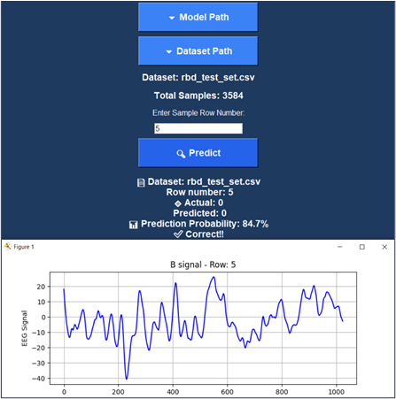

# CAP Phase Classifier: Automated EEG Analysis for Sleep Diagnostics

A deep learning tool designed to automate the classification of Cyclic Alternating Pattern (CAP) sleep phases from single-channel EEG signals. This project addresses the critical challenge of manual CAP phase scoring, which is labor-intensive for clinicians but holds significant potential for diagnosing sleep disorders like narcolepsy, REM sleep behavior disorder (RBD), and insomnia. The system provides a completely autonomous approach, requiring no manual feature extraction.

## Features

-   **Automated CAP Phase Classification:** Classifies 2-second EEG signal segments into CAP Phase A (aggregating sub-phases A1, A2, A3) or Phase B.
-   **Multi-Condition Analysis:** The model is trained and evaluated on data from healthy subjects and those with various sleep disorders (Narcolepsy, RBD, PLM, NFLE, Insomnia).
-   **Interactive Testing Interface:** A dedicated interface allows for visualizing individual EEG cases, running model predictions, and comparing the results against the true labels with prediction probabilities.
-   **Optimized Model Architecture:** Utilizes a high-performing 1D Convolutional Neural Network (CNN) architecture, identified through rigorous validation on healthy subject data and then applied consistently across all other conditions.

## Model Architecture & Training

The core of this project is a 1D Convolutional Neural Network (CNN) designed to process raw, standardized EEG signals sampled at 512 Hz. The best-performing architecture was first determined using validation set from the healthy subject dataset, employing validation-based early stopping and model checkpointing to prevent overfitting and save the best model. This same optimal architecture was subsequently used to train separate models for each health condition (Healthy, Narcolepsy, Insomnia, etc.).

## Results

The model demonstrates robust performance across different sleep conditions. The following metrics represent a weighted average based on each model's performance on its corresponding test set:

-   **Accuracy:** 76.77%
-   **Recall:** 74.46%
-   **F1 Score:** 76.19%

*Note: Performance varies by specific health condition. Detailed results for each condition are available in the `results/` folder.*

## Installation & Setup

1.  **Clone the repository**
    ```bash
    git clone https://github.com/Ghifar-Khder/CAP-phase-detection.git
    cd CAP-phase-detection
    ```

2.  **Install dependencies**
    Ensure you have Python installed, then run:
    ```bash
    pip install -r requirements.txt
    ```

## Dataset Setup

This project uses the CAP Sleep Database from Kaggle.

-   **Source:** [CAP Sleep Database on Kaggle](https://www.kaggle.com/datasets/shrutimurarka/cap-sleep-unbalanced-dataset)
-   **Used Subset:** The `balanced` directory, which contains an equal number of Phase A and Phase B samples. Phase A is internally balanced with equal parts A1, A2, and A3.

**Setup Instructions:**
1.  Download the dataset from the link above.
2.  The data is not stored in this repository. You must place the downloaded files in a `data/` folder within the project directory.
3.  For each health condition folder inside `balanced/` (e.g., `healthy`, `ins`, `narco`), you must split the data into `train/`, `val/`, and `test/` and create a  trained model for the corresponding health condition by running source code: `src/model.py`.

- **Note:** you must update all file paths in `src/model.py` in order to work properly.

4.  Update all file paths in the source code (`src/interface.py`) to point to your local dataset and model directories.

## Usage

### 1. Training the Models
To train a model for a specific health condition, configure the paths in `src/model.py` and run it. This script will handle the training, validation, and testing for the specified condition, saving the best model to the `models/` folder.

### 2. Launching the Testing Interface (Recommended)
The interactive interface is the primary way to test and visualize the model's predictions on individual EEG cases.

```bash
python src/interface.py
```
**Using the Interface:**
-   Before running, you must set the default paths for your trained model and test data within the `src/interface.py` script.
-   Upon launch, the interface will allow you to:
    1.  Confirm or change the paths to the model and data.
    2.  Enter the row number of a specific case in the test dataset.
-   The interface will then:
    -   Display the raw EEG signal for the selected 2-second segment.
    -   Run the model prediction.
    -   Show the predicted class (A or B) and the true class for comparison.
    -   Display the prediction probability, providing insight into the model's confidence.

## Project Structure

```
CAP-Phase-Classifier/
├── data/                   # Directory for dataset (not versioned)
│   └── balanced/           # Place the downloaded balanced dataset here
├── models/                 # Pre-trained models for each condition
│   ├── healthy_model.keras
│   ├── ins_model.keras
│   └── ...
├── results/                # Detailed test results (CSV files)
│   ├── healthy-results.csv
│   ├── ins-results.csv
│   └── ...
├── src/                    # Source code
│   ├── interface.py        # Interactive testing application
│   ├── model.py           # Training and evaluation script
│   └── results.py         # Script for generating result metrics
├── .gitignore
├── requirements.txt
└── README.md
```

## Interface Preview

The user interface is a Python application that runs locally. It is designed for clarity and functionality, allowing researchers and clinicians to test model predictions and visualize the corresponding EEG data easily.

# **THE DESIGNED INTERFACE:**



